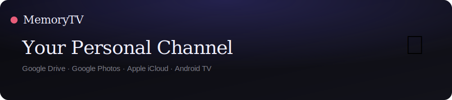
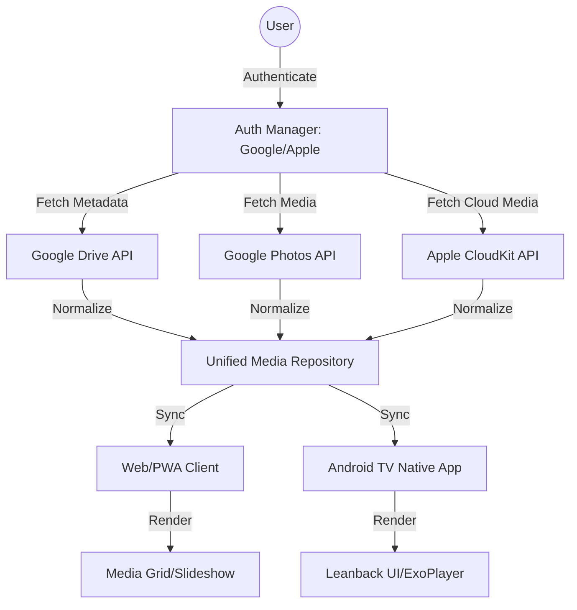

# 📺 MemoryTV — Your Personal Memory Channel

> Stream your photos and videos from Google Drive, Google Photos, Apple iCloud and local storage — organized by people, events and places — on any screen.



---

## 🏗️ Architecture



---

## ✨ Features

| Feature | Status |
|---------|--------|
| Google Drive streaming | ✅ |
| Google Photos streaming | ✅ |
| Apple iCloud / Photos | ✅ |
| Local storage / USB | ✅ |
| Filter by person / face | ✅ |
| Filter by event / album | ✅ |
| Filter by location | ✅ |
| Custom channel builder | ✅ |
| TV Mode (full-screen slideshow) | ✅ |
| D-pad / remote control | ✅ |
| PWA (installable, offline) | ✅ |
| Android TV native app | ✅ |
| Background sync | ✅ |
| Push notifications | ✅ |

---

## 🚀 Quick Start

### Web App (PWA)
\`\`\`bash
npx serve .
# or open index.html directly in Chrome / Android TV browser
\`\`\`

### Install as PWA
1. Open the app in Chrome
2. Click **Install** in the address bar (or the in-app install button)
3. MemoryTV installs as a standalone app on your device

---

## 📁 Project Structure

\`\`\`
memorytv/
├── index.html                    # Main web app entry point
├── manifest.json                 # PWA manifest
├── service-worker.js             # Offline caching & background sync
├── css/
│   ├── main.css                  # Design system & layout
│   ├── sidebar.css               # Filters & playlists
│   ├── media.css                 # Media grid & cards
│   ├── tv-mode.css               # TV fullscreen player
│   └── connect.css               # Sources & channel builder
├── js/
│   ├── auth.js                   # Google OAuth + Apple Sign In + PWA
│   ├── data.js                   # Sample data & media items
│   ├── app.js                    # Routing, grid, toast, init
│   ├── tv.js                     # TV player logic
│   ├── filters.js                # Filter chip logic
│   └── channels.js               # Channel builder
├── assets/
│   └── banner.svg
├── android-tv/                   # Native Android TV Kotlin app
│   └── app/src/main/
│       ├── AndroidManifest.xml
│       └── java/com/memorytv/
│           ├── ui/MainActivity.kt
│           ├── tv/ChannelPlayerActivity.kt
│           ├── auth/GoogleAuthManager.kt
│           └── data/MediaRepository.kt
├── .github/workflows/deploy.yml  # Auto-deploy to GitHub Pages
├── package.json
├── .gitignore
└── README.md
\`\`\`

---

## 🔌 Google OAuth Setup

### Step 1 — Google Cloud Project
1. Go to [console.cloud.google.com](https://console.cloud.google.com)
2. Create project → enable **Google Drive API** + **Google Photos Library API**

### Step 2 — OAuth Credentials
1. **APIs & Services → Credentials → Create → OAuth 2.0 Client ID**
2. Type: **Web application**
3. Authorized origins: `https://mnk-nasir.github.io`
4. Redirect URIs: `https://mnk-nasir.github.io/memorytv`

### Step 3 — Add Client ID
```js
// js/auth.js
const CONFIG = {
  GOOGLE_CLIENT_ID: 'YOUR_CLIENT_ID.apps.googleusercontent.com',
  REDIRECT_URI: 'https://mnk-nasir.github.io/memorytv',
};
```

### For Android TV
1. Create an **Android** OAuth 2.0 Client ID
2. Get SHA-1: `keytool -list -v -keystore ~/.android/debug.keystore -alias androiddebugkey -storepass android`
3. Download `google-services.json` → place in `android-tv/app/`

---

## 🍎 Apple iCloud Setup

### Step 1 — Apple Developer Account
1. Enrol at [developer.apple.com](https://developer.apple.com)
2. Register a **Services ID**: `com.yourapp.memorytv`

### Step 2 — Sign in with Apple
1. Enable **Sign in with Apple** on your Services ID
2. Add domain: `mnk-nasir.github.io`
3. Return URL: `https://mnk-nasir.github.io/memorytv`

### Step 3 — CloudKit
1. [icloud.developer.apple.com](https://icloud.developer.apple.com) → Create container
2. Container ID: `iCloud.com.yourapp.memorytv`
3. Generate **API Token** under API Access

### Step 4 — Add credentials
```js
// js/auth.js
const CONFIG = {
  APPLE_CLIENT_ID:    'com.yourapp.memorytv',
  APPLE_REDIRECT_URI: 'https://mnk-nasir.github.io/memorytv',
};
```

---

## 📺 Android TV Build

```bash
cd android-tv

# Debug — install via ADB
./gradlew assembleDebug
adb connect YOUR_TV_IP:5555
adb install -r app/build/outputs/apk/debug/app-debug.apk

# Release
./gradlew assembleRelease
\`\`\`

| File | Purpose |
|------|---------|
| \`MainActivity.kt\` | TV home screen, D-pad routing |
| \`ChannelPlayerActivity.kt\` | Fullscreen slideshow + ExoPlayer |
| \`GoogleAuthManager.kt\` | Google Sign-In (Drive + Photos) |
| \`MediaRepository.kt\` | Unified API fetcher for all sources |

---

## ⌨️ Keyboard / D-pad Shortcuts

| Key | Action |
|-----|--------|
| \`→\` \`↓\` | Next media |
| \`←\` \`↑\` | Previous media |
| \`Space\` \`Enter\` | Play / Pause |
| \`Escape\` | Exit TV Mode |

---

## 🗺️ Roadmap

- [x] Google Drive & Photos integration
- [x] Apple iCloud Sign In + CloudKit
- [x] PWA with offline support + background sync
- [x] Android TV native Kotlin app
- [ ] Chromecast / Google Cast
- [ ] AirPlay support
- [ ] Face recognition (Google Vision API)
- [ ] "On This Day" auto-channel
- [ ] Background music tracks
- [ ] Multi-user profiles
- [ ] Google Play Store release

---

## 🛠️ Tech Stack

**Web / PWA** — Vanilla HTML/CSS/JS, Service Worker, Web App Manifest

**Android TV** — Kotlin, Leanback, ExoPlayer (Media3), Coil, Hilt, Room, Retrofit

**APIs** — Google Drive v3, Google Photos Library v1, Apple CloudKit REST, Sign in with Apple

---

MIT License — Made with ❤️ powered by your memories.
